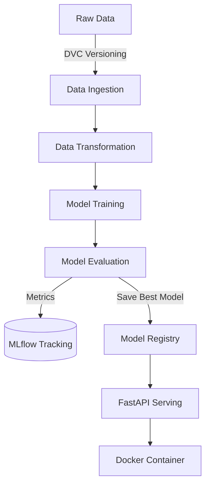

# 🔄 End-to-End MLOps Pipeline


A fully automated, production-ready Machine Learning Operations (MLOps) pipeline demonstrating best practices in model lifecycle management.

## ✨ Features
- **Data Versioning:** Handled via DVC to ensure reproducibility.
- **Experiment Tracking:** MLflow integration for logging metrics, parameters, and model artifacts.
- **Modular Pipeline:** Separate scripts for Data Ingestion, Transformation, Model Training, and Evaluation.
- **Model Serving:** Real-time inference API built with FastAPI.
- **Containerization:** Docker & Docker Compose for isolated and consistent environments.
- **CI/CD:** Automated testing and linting via GitHub Actions.

## 🏗️ Architecture


## 🚀 Installation & Usage

1. **Clone the repository:**
   ```bash
   git clone https://github.com/yourusername/mlops-pipeline.git
   cd mlops-pipeline
   ```

2. **Initialize Environment (Docker):**
   ```bash
   docker-compose up --build
   ```
   This starts both the FastAPI prediction service on `localhost:8000` and the MLflow UI on `localhost:5000`.

3. **Run Pipeline Locally (Optional):**
   ```bash
   python src/data_ingestion.py
   python src/data_transformation.py
   python src/model_trainer.py
   python src/model_evaluation.py
   ```

## 📡 API Endpoints
- `GET /`: Health check.
- `POST /predict`: Submit feature JSON to get predictions.

## 🛠️ Tech Stack
- **Languages:** Python
- **Libraries:** Scikit-learn, Pandas, FastAPI
- **MLOps Tools:** DVC, MLflow, Docker, GitHub Actions
